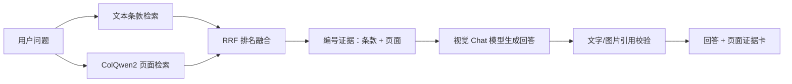

# 多模态 RAG：从 PDF 页面到可验证回答

这份文档从头解释项目中新加入的多模态 RAG。它不是“给 OCR 文本换一个名字”，也不是先让大模型给每张图片写 caption 再做普通文本检索，而是让检索模型直接比较“用户问题”和“整页 PDF 图像”。

## 1. 它解决什么问题

原来的文本 RAG 很适合普通法规段落：PDF 被解析为 Markdown，按章节切成父子块，子块用于召回，最后展开为完整条款。

但下面这些信息在转成纯文本后容易丢失：

- 跨行、跨列的复杂表格；
- 图中的层级、箭头、颜色和空间关系；
- 页眉、脚注、表题与正文之间的版面关系；
- 扫描 PDF 中无法可靠提取的文字。

多模态 RAG 增加的是第二条证据通道。文本通道仍然存在，精确条款定位仍由它负责；视觉通道专门补足页面结构信息。



## 2. 页面数据是怎样生成的

运行：

```powershell
uv run python -m ingest.visual
```

`ingest/visual.py` 会完成四件事：

1. 找到 `data/raw/*.pdf` 中的受治理 PDF；
2. 使用 PyMuPDF 按 144 DPI 把每一页渲染为 PNG；
3. 优先读取 MinerU 的 `*_content_list.json`，按页汇总正文、列表、表格和图片说明；没有 MinerU 结果时使用 PDF 自带文字；
4. 写出 `data/visual/manifest.json`。

每一页都有稳定标识，例如：

```text
GBT-35273@2020#page=22
```

这个标识同时包含来源、版本和 PDF 页序号。页面图片才是视觉检索输入；清单里的 OCR 文本只用于证据卡展示、人工审计和文本兜底。

本仓库当前的三个 PDF 会生成 214 页。生成目录被 Git 忽略，因为它可以由原始 PDF 确定性重建。

## 3. 视觉向量怎样进入 Qdrant

运行：

```powershell
uv run python -m rag.visual index
```

`rag/visual.py` 使用 `vidore/colqwen2-v1.0-hf`。ColQwen2 不把一页压成一个向量，而是为页面中的多个视觉 token 生成一组 128 维向量；问题也会生成一组 token 向量。

专用集合名为 `grc_visual_pages`，每个点有两个命名向量：

- `dense`：页面多向量的归一化均值，只用于快速预召回；
- `late`：完整页面多向量，由 Qdrant 使用 MaxSim 做精细重排。

一次查询分两步：先用 `dense` 取 20 个候选页，再用问题多向量对候选页的 `late` 向量计算 MaxSim，返回前 5 页。`late` 向量关闭独立 HNSW 建图，因为它只在预召回得到的小候选集上重排，可以减少内存和建索引开销。

## 4. 文本和图片怎样融合

`rag/multimodal.py` 同时调用：

- 原有文本链路：BGE-M3 Dense + parent expansion + reranker；
- 新增视觉链路：ColQwen2 + Qdrant MaxSim。

两边的原始分数尺度不同，不能直接比较。因此使用 Reciprocal Rank Fusion（RRF）按名次融合。文本第一名和视觉第一名会得到相同级别的融合分，最终证据通常交替包含条款和页面。

视觉证据仍遵守 Agent 的稳定字段：`parent_id`、`source_id`、`version`、`section_number`、`text`、`score`。它只增加：

- `modality=image`；
- `page_number`；
- 服务端内部使用的 `image_path`；
- 浏览器使用的同源 `image_url`。

`image_path` 不会进入 SSE；API 只允许发送 `/visual-assets/...` URL。

## 5. 大模型是否真的看到了图片

是。`agent/llm.py` 检测到图像证据后会：

1. 验证图片确实位于受治理的 `data/visual/pages` 目录；
2. 将页面缩放到最长边 1600 像素并压缩为 JPEG；
3. 通过 Chat Completions 的 `image_url` 内容块发送图片；
4. 使用 `LLM_VISION_MODEL` 生成答案；
5. 引用校验遇到图片证据时，也把同一页面交给视觉模型判断 claim 是否被支持。

纯文本证据不会触发图片编码，仍使用原来的 `LLM_MODEL` 文本请求。修复回答的第二次生成也会保留图片，而不是在重试时退化为 OCR 文本。

## 6. 如何开启

先确认：

- `data/raw/` 中存在要索引的 PDF；
- Qdrant 正在运行；
- `LLM_VISION_MODEL` 对应的 OpenAI-compatible endpoint 接受 Chat Completions `image_url` 内容。如果 `LLM_MODEL` 本身支持图片，可以留空复用它。

在 `.env` 中设置：

```dotenv
APP_RUN_MODE=real
MULTIMODAL_RAG_ENABLED=true
VISUAL_MODEL=vidore/colqwen2-v1.0-hf
LLM_VISION_MODEL=your-vision-chat-model
MODEL_DEVICE=cuda
```

然后照常启动：

```powershell
uv run python -m api.serve
```

启动器会先保证文本索引存在，再生成页面并建立视觉索引。以后只要清单和 Qdrant 集合都存在，就会直接复用。

Docker Compose 也是同样的开关：

```powershell
docker compose up --build
```

Compose 使用独立 `visual_pages` volume 持久化页面，并复用 `model_cache` 下载缓存。

## 7. 资源和失败模式

ColQwen2 是本地视觉检索模型，不是远程聊天模型。第一次运行需要下载权重，页面索引也明显比普通文本索引更耗时。

- 有 NVIDIA GPU 时建议 `MODEL_DEVICE=cuda`；
- CPU 可以运行，但模型加载、页面编码和查询都会慢很多；
- 如果远程聊天模型不支持图片，请不要开启多模态开关，否则生成阶段会被 endpoint 拒绝；
- 关闭 `MULTIMODAL_RAG_ENABLED` 即可完整回退到原有文本 RAG；
- `grc_kb` 和 `grc_visual_pages` 是两个独立集合，删除视觉集合不会损坏文本索引。

## 8. 怎样评测，而不是只看 Demo

仓库提供 10 条人工核对的表格问题：

```powershell
uv run python -m evals.run_multimodal_eval evals/multimodal_dataset.jsonl --output results/multimodal.json
```

评测会分别运行 text、visual、hybrid 三条链路，并输出：

- Recall@5：前 5 条里覆盖了多少 gold 证据；
- MRR：第一条正确证据出现得有多靠前；
- P50/P95 latency：典型和尾部检索延迟。

数据集把 `gold_text_ids` 与 `gold_page_ids` 分开记录，因为一个条款 ID 和一个 PDF 页 ID 是两种不同粒度的正确答案。Hybrid 使用两者并集，不能把“文本没返回 page ID”误判成文本内容完全无关。

## 9. 代码入口

| 文件 | 职责 |
|---|---|
| `ingest/visual.py` | 渲染 PDF、合并按页 OCR、生成清单 |
| `rag/visual.py` | ColQwen2 编码、Qdrant 多向量建库和 MaxSim 查询 |
| `rag/multimodal.py` | 文本/视觉 RRF 融合与视觉证据映射 |
| `agent/tools.py` | 可选的多模态本地 Tool backend |
| `agent/nodes.py` | 仅在法规问答中选择多模态搜索 |
| `agent/llm.py` | 图片生成请求、修复请求和视觉引用校验 |
| `api/main.py` | 安全的页面静态路由和 SSE 引用白名单 |
| `web/app.js` | 页面证据缩略图 |
| `evals/run_multimodal_eval.py` | 三路检索对比评测 |

条款比较和控制差距分析仍默认使用文本检索，因为这两个工作流依赖精确条款和结构化控制事实。当前实现先把视觉能力放在最能受益、也最容易验证的法规问答路径上。
