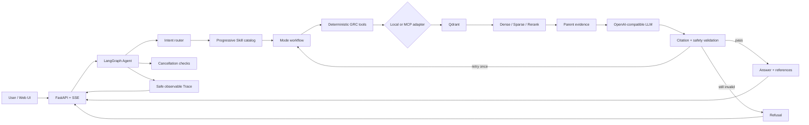

# GRC Copilot

**An evidence-first compliance Agent for regulation Q&A, clause comparison, and control gap analysis.**

English | [简体中文](README.zh-CN.md)

GRC Copilot is a portfolio-grade prototype for governance, risk, and compliance work. It combines versioned regulatory evidence, hybrid RAG components, progressively disclosed workflow Skills, LangGraph orchestration, deterministic citation checks, an MCP tool boundary, and an observable streaming UI.

The project is built around one rule: a fluent answer is not enough. Every material conclusion should be traceable to a specific source, version, and section—and the system should refuse when the available evidence cannot support the request.

> **Project status:** the repository contains the ingestion, retrieval, Agent, validation, evaluation, MCP, API, and UI components. The reproducible Docker quickstart intentionally uses deterministic fixtures so it can run without private corpus files, a built index, or an API key. See [What the demo does and does not prove](#what-the-demo-does-and-does-not-prove).

## Why this project exists

General-purpose chat interfaces are a risky fit for compliance work:

- the same section number can mean different things across document versions;
- a comparison is invalid if evidence from either side is missing;
- an enterprise control description is a statement of current fact, not proof of compliance;
- plausible but unsupported citations are more dangerous than an explicit refusal;
- operators need to see which tools ran and be able to stop expensive work.

GRC Copilot turns those concerns into explicit software boundaries, tests, and evaluation metrics instead of relying on a larger prompt alone.

## What it does

| Mode | Input | Output | Refusal boundary |
|---|---|---|---|
| Regulation Q&A | A question about an included regulation or standard | A grounded answer with versioned references | Refuses when no usable regulation evidence is found |
| Clause comparison | Two identifiable clauses, documents, or versions plus a comparison dimension | Left/right evidence and a scoped comparison | Refuses when either side is missing or the dimension is unsupported |
| Control gap analysis | A requirement question plus the enterprise's current control facts | Requirement-to-control mapping, gaps, risks, recommendations, and evidence | Refuses when current-state facts or regulation evidence are missing; never declares final compliance |

For gap analysis, `control_text` is the user's description of what the organization currently does—for example, “administrator accounts use passwords only.” It should not contain a pre-written conclusion such as “we are compliant.” The Agent compares that factual description with retrieved requirements and leaves the final determination to a human reviewer.

## Architecture



The retrieval path uses child chunks for precise matching and expands them to versioned parent sections before generation. The final answer operates on parent evidence IDs such as `GBT-22239@2019#7.1.4.1`, not Qdrant point IDs.

### Graph, Skills, and Tools: who owns what?

| Layer | Owns | Does not own |
|---|---|---|
| Graph | State transitions, routing order, retry limits, cancellation checks, verification, terminal status | Regulation content or backend-specific search code |
| Skills | Task-specific SOPs, evidence requirements, refusal boundaries, output structure | Tool execution, network calls, or mutable state |
| Tools | Deterministic search, clause lookup, comparison, control extraction, and gap mapping | Workflow policy or final compliance judgment |
| LLM | Intent proposal, grounded drafting, query rewriting, structured extraction | Source-of-truth status or permission to bypass validation |
| Validator | Citation numbering, source/version consistency, claim support, gap-analysis safety boundaries | Creative answer generation |
| API | Stable SSE events, safe Trace projection, task registration, cancellation, health/readiness | Hidden reasoning or raw internal Agent state |

Skills are progressively disclosed: the router sees a lightweight catalog, and only the matched Skill body and its resources are loaded. Unsupported requests load no domain Skill.

## Key engineering decisions

- **Versioned evidence contracts:** `source_id`, `version`, `section_number`, and `parent_id` remain attached through parsing, indexing, retrieval, generation, and validation.
- **Parent-child retrieval:** small child chunks improve matching; expanded parent sections give the model enough legal and technical context.
- **Evidence-gated generation:** an empty retrieval result never calls the answer generator.
- **Deterministic checks before model checks:** unknown citations and version mismatches fail before semantic entailment is evaluated.
- **Bounded retries:** a failed answer may trigger one query rewrite and retry; a second failure becomes a refusal.
- **Progressive Skills:** load only the SOP needed for the selected mode, reducing prompt tokens and unrelated instructions.
- **Local/MCP parity:** the Graph calls a stable tool interface that can be backed by local Python functions or MCP.
- **Observable, not revealing:** the browser receives safe fields such as node, tool, duration, and status—not full prompts, Skill bodies, API keys, or hidden reasoning.
- **Cancellable work:** cancellation is checked around the workflow, and the API awaits coroutine cleanup so stopped requests do not remain as zombie tasks.

## Quickstart: deterministic Docker demo

This is the fastest path from a clean checkout to a working browser UI. It requires Docker Compose v2 and does **not** require an LLM API key.

### 1. Create the local environment file

macOS/Linux:

```bash
cp .env.example .env
```

PowerShell:

```powershell
Copy-Item .env.example .env
```

The default `APP_RUN_MODE=demo` is the only container run mode currently supported.

### 2. Build and start the two services

```bash
docker compose up --build --wait
```

Compose starts exactly two services:

- `app`: FastAPI, the browser UI, the stable SSE contract, and deterministic demo fixtures;
- `qdrant`: Qdrant `v1.18.2`, including readiness and persistent storage.

### 3. Open the UI

Open [http://127.0.0.1:8000](http://127.0.0.1:8000), select a mode, and try:

```text
Regulation Q&A:      管理员身份鉴别有哪些要求？
Clause comparison:  比较两项身份鉴别条款的要求和适用范围
Gap analysis:       检查管理员身份鉴别控制差距
Current control:    管理员目前仅使用账号和密码登录，尚未启用多因素认证。
```

The right-hand panel separates evidence cards from the Agent Trace. A cited `[1]` maps to the first evidence card.

### 4. Verify readiness

```bash
docker compose ps
curl http://127.0.0.1:8000/ready
curl http://127.0.0.1:6333/readyz
```

On Windows PowerShell, use `curl.exe` if `curl` is mapped to `Invoke-WebRequest`.

Both containers should be healthy. The app waits for Qdrant before accepting `/chat` requests.

### 5. Optional SSE smoke test

macOS/Linux:

```bash
curl -N -X POST http://127.0.0.1:8000/chat \
  -H 'Content-Type: application/json' \
  -d '{"request_id":"readme-qa","mode":"regulation_qa","query":"管理员身份鉴别有哪些要求？"}'
```

PowerShell:

```powershell
curl.exe -N -X POST http://127.0.0.1:8000/chat `
  -H "Content-Type: application/json" `
  -d '{"request_id":"readme-qa","mode":"regulation_qa","query":"管理员身份鉴别有哪些要求？"}'
```

The stream should contain `status`, one or more `text` events, a versioned `reference`, safe `trace` events, and one terminal `done` event.

### Stop and clean up

```bash
docker compose down
```

This preserves the `qdrant_storage` and `model_cache` named volumes. The following command is destructive:

```bash
docker compose down --volumes
```

It deletes the Qdrant data and the container model cache.

### Quickstart troubleshooting

- **`docker` is not recognized:** install Docker Desktop or Docker Engine with the Compose v2 plugin, start the daemon, open a new terminal, and verify `docker compose version` before retrying.
- **A container is unhealthy:** run `docker compose ps`, `docker compose logs qdrant`, and `docker compose logs app`. The app intentionally remains unready until Qdrant responds.
- **Port 8000 or 6333 is already in use:** change `APP_HOST_PORT` or `QDRANT_HOST_PORT` in `.env`, then rerun Compose.
- **The first build takes longer than expected:** the image and locked Python packages must be downloaded once. Later builds and the named model cache are reusable.

## What the demo does and does not prove

The Docker demo proves that a clean checkout can reproduce:

- app/Qdrant startup order and readiness;
- the three-mode browser workflow;
- stable Server-Sent Events;
- answer streaming, evidence cards, recommendations, and safe Trace;
- request cancellation and terminal cleanup;
- persistent Qdrant and model-cache locations.

The demo runner returns explicit fixtures. It does **not** claim that an LLM generated those answers or that Qdrant retrieved the fixture evidence. This is intentional:

- raw licensed or governed corpus files are not committed;
- built vector indexes and local model caches are not committed;
- the container image installs only the small deployment dependency group;
- `api.main:app` has an intentionally unconfigured runner, so missing production composition fails explicitly instead of silently serving demo answers.

A real deployment must provide governed documents, build the index, configure an OpenAI-compatible endpoint, and inject the real Agent runner. The repository implements those lower-level components but does not relabel the deterministic deployment fixture as a production system.

## API and event contract

### Endpoints

| Method | Path | Purpose |
|---|---|---|
| `GET` | `/health` | Process liveness and active task count |
| `GET` | `/ready` | Dependency readiness |
| `POST` | `/chat` | Start one streamed Agent request |
| `POST` | `/tasks/{request_id}/stop` | Cancel a live request and await cleanup |

`POST /chat` accepts:

```json
{
  "request_id": "optional-client-id",
  "mode": "regulation_qa",
  "query": "管理员身份鉴别有哪些要求？",
  "control_text": ""
}
```

The seven stable SSE event types are:

```text
status · text · reference · recommendation · trace · done · error
```

Every stream ends with exactly one terminal `done` or `error`. Events arriving after a terminal event or from a different request ID are ignored by the browser contract.

## Local development

### Requirements

- Python 3.13
- [`uv`](https://docs.astral.sh/uv/)
- Docker, when Qdrant-backed retrieval is needed
- CUDA is optional; runtime device selection also supports CPU

Install the locked environment and run the tests:

```bash
uv sync --locked
uv run pytest -p no:cacheprovider -q
```

Current verified result:

```text
270 passed
```

Validate the fixed evaluation dataset:

```bash
uv run python -m evals.validate_dataset evals/dataset.jsonl
```

Expected result:

```text
valid=60 invalid=0
```

Run the deterministic deployment app against a local Qdrant instance:

```bash
QDRANT_URL=http://127.0.0.1:6333 \
uv run uvicorn api.deployment:app --host 127.0.0.1 --port 8000
```

PowerShell:

```powershell
$env:QDRANT_URL = "http://127.0.0.1:6333"
uv run uvicorn api.deployment:app --host 127.0.0.1 --port 8000
```

The ingestion and evaluation paths use the full local dependency set. Corpus provenance and parsing decisions are documented in [SOURCES.md](SOURCES.md). Raw files belong in the git-ignored `data/raw/` directory.

## Evaluation

The frozen dataset contains 60 cases across regulation Q&A, cross-regulation comparison, control gap analysis, colloquial questions, refusals, and version traps. Gold citations are versioned parent-section IDs derived from source material, not copied from the Agent's current answers.

### Final end-to-end result

| Metric | Result | Scope |
|---|---:|---|
| Recall@5 | 79.79% | 47 answerable cases |
| Recall@20 | 85.11% | 47 answerable cases |
| MRR | 0.7218 | 47 answerable cases |
| Citation precision | 36.70% | 47 answerable cases |
| Citation coverage | 68.09% | 47 answerable cases |
| Refusal accuracy | 85.00% | all 60 cases |
| Intent accuracy | 93.33% | all 60 cases |
| Skill trigger accuracy | 93.33% | all 60 cases |
| P50 latency | 8,776.81 ms | end-to-end |
| P95 latency | 35,727.05 ms | end-to-end |
| Average tokens | 3,411.52 | end-to-end |

These are observed results, not promises. The refusal target of 85% and Skill trigger target of 90% were met. The citation precision target of 90% was **not** met; 36.70% is retained as the honest result and is the clearest quality limitation of the current system.

The final run keeps up to 20 retrieved results for real Recall@5/20 measurement while sending the first five to generation. A single-variable trial reduced only the generation context from five items to three. On same-route paired cases, citation precision improved by only 0.19 percentage points while citation coverage fell by 11.36 points, so the trial was rejected.

Run the final evaluator only after configuring the real corpus/index and the `LLM_*` values in `.env`:

```bash
uv run python -m evals.run_eval
```

The evaluator records dataset, Prompt, Skill, parameter, Git, and configuration hashes and keeps all errors instead of filtering failed cases.

## Retrieval ablation

Eight retrieval combinations were evaluated on the same frozen dataset and corpus. This table reports the retrieval-only experiment; it is intentionally separate from the end-to-end Agent result above.

| Chunking | Sparse | Rerank | Recall@5 | MRR | P95 ms |
|---|---:|---:|---:|---:|---:|
| Fixed window | No | No | 50.00% | 0.3807 | 42.69 |
| Fixed window | No | Yes | 60.64% | 0.4628 | 239.90 |
| Fixed window | Yes | No | 55.32% | 0.4090 | 46.69 |
| Fixed window | Yes | Yes | 68.09% | 0.5397 | 238.40 |
| Parent-child | No | No | 69.15% | 0.5673 | 39.80 |
| **Parent-child** | **No** | **Yes** | **81.91%** | **0.7365** | 243.46 |
| Parent-child | Yes | No | 68.09% | 0.6330 | 45.07 |
| Parent-child | Yes | Yes | 80.85% | 0.7110 | 242.43 |

The largest individual improvement came from parent-child chunking: under Dense retrieval without reranking, Recall@5 increased by 19.15 percentage points over fixed windows. Reranking added another 12.77 points on parent-child evidence, at a latency cost. Sparse/hybrid retrieval did not improve the parent-child configurations, so the final path leaves it disabled.

## Skills ablation

The Skill experiment fixed the questions, task labels, evidence, model, temperature, and output limit, changing only how workflow instructions were disclosed.

| Strategy | Avg. input tokens | P95 ms | Structured success | Citation format | False trigger | Missed trigger |
|---|---:|---:|---:|---:|---:|---:|
| No Skill | 398.42 | 14,414.34 | 58.33% | 75.00% | 0.00% | 100.00% |
| All SOPs | 1,922.42 | 33,137.44 | 75.00% | 75.00% | 100.00% | 0.00% |
| **Progressive** | **779.42** | 23,896.23 | **91.67%** | **91.67%** | **0.00%** | **0.00%** |

Progressive disclosure reduced average input tokens by 59.46% versus loading all SOPs, while structured success increased rather than regressed in this 12-case controlled subset. The result supports Skills as task SOPs, not as a replacement for tools or validation.

## Failure analysis

The system attributes a failure to the first observable layer that diverged, rather than blaming the final model output for every downstream symptom.

| Case | First failing layer | Evidence | Why it matters |
|---|---|---|---|
| `grc-v0-011` | Retrieval | Routing and Skill were correct, but the second comparison-side gold section was absent from Top-20 | A one-sided comparison must refuse rather than fabricate the missing side |
| `grc-v0-021` | Routing / Skill | A regulation question was classified as unsupported, so no Skill or retrieval ran | Early routing errors make every downstream metric look worse |
| `grc-v0-001` | Generation | The correct gold section ranked first, but the answer cited a similar section from another security level | A polished, cited, but wrong answer is more dangerous than an explicit refusal |

The most important open quality problem is evidence selection during generation and citation validation. The next iteration should improve section-aware selection, left/right retrieval constraints, and claim-to-citation verification—not hide the failures by deleting hard cases.

## Safety boundaries

- Retrieved document text is treated as untrusted input. HTML-sensitive evidence delimiters are escaped before the text is wrapped in `<evidence>` boundaries.
- Version mismatches between `parent_id` and evidence metadata fail deterministically before semantic model evaluation.
- Unsupported citation numbers, uncited factual claims, and unsupported claims fail validation.
- Gap analysis must include a human-review disclaimer and cannot declare that an enterprise is definitively compliant or illegal.
- Empty evidence produces a refusal without calling the answer generator.
- The Graph retries at most once and has an explicit maximum step limit.
- Cancellation is checked before and after the mode workflow; API task cleanup is awaited.
- External Trace uses a field allowlist. Full queries, API keys, Skill bodies, and hidden reasoning are not emitted as Trace events.
- This prototype assists evidence review; it does not provide legal advice or replace a qualified compliance or legal reviewer.

The regression suite explicitly covers document Prompt Injection, version conflict, no-answer behavior, cancellation, zombie-task cleanup, and safe Trace projection.

## Corpus and provenance

The tracked provenance record covers five documents:

- GB/T 22239—2019;
- GB/T 35273—2020;
- GDPR, Regulation (EU) 2016/679;
- Cybersecurity Law of the PRC, amended text published in 2025;
- Data Security Law of the PRC, 2021.

See [SOURCES.md](SOURCES.md) for source locations and parsing decisions. ISO/IEC 27001 full text is excluded because it is paid; the ISO line shown in the Docker comparison is a clearly labeled deterministic fixture, not a committed production corpus.

## Repository layout

```text
agent/       LangGraph state, nodes, Skills, cancellation, local/MCP adapters
api/         FastAPI, stable SSE events, safe Trace, task management, demo composition
evals/       60-case dataset, metrics, retrieval/Skill ablations, final evaluator
ingest/      Versioned parsing, parent-child chunking, embedding, Qdrant indexing
mcp_server/  MCP exposure of deterministic GRC tools
rag/         Dense/sparse retrieval, fusion, reranking, generation, citation checks
runtime/     CPU/CUDA device selection
skills/      Regulation Q&A, clause comparison, and gap-analysis SOPs
tests/       Contract, regression, safety, evaluation, and deployment tests
web/         Three-mode observable browser UI
```

## Current limitations

- The Docker deployment is a deterministic demo, not the production composition root.
- Raw corpus files, built indexes, and model caches are intentionally excluded from Git.
- Citation precision remains below the project target.
- Evaluation covers five governed sources and 60 cases, not every jurisdiction or compliance framework.
- Gap analysis depends on the accuracy and completeness of user-provided current-control facts.
- Human review remains mandatory for legal interpretation, applicability, and final compliance decisions.

These limitations are kept explicit because the project's value is not “an LLM that always answers.” It is an inspectable system that knows where evidence, orchestration, and human accountability begin and end.
