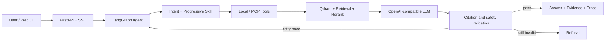

# GRC Copilot

**An evidence-first compliance Agent for regulation Q&A, clause comparison, and control gap analysis.**

English | [简体中文](README.zh-CN.md)

GRC Copilot is a portfolio project for governance, risk, and compliance workflows. It combines versioned regulatory evidence, parent-child retrieval, LangGraph orchestration, progressive Skills, deterministic citation checks, MCP-compatible tools, and an observable streaming UI.

The core rule is simple: a fluent answer is not enough. Important claims should point to a specific source, version, and section; when the evidence is insufficient, the Agent should refuse.

## What it does

| Mode | Purpose | Safety boundary |
|---|---|---|
| Regulation Q&A | Answer questions from versioned regulation evidence | Refuses when no usable evidence is found |
| Clause comparison | Compare two clauses while preserving evidence from both sides | Refuses when either side is missing |
| Control gap analysis | Compare enterprise control facts with regulatory requirements | Requires current-state facts and leaves the final decision to a human reviewer |

For gap analysis, `control_text` describes what the organization currently does. It is not a pre-written compliance conclusion.

## Architecture



- **Graph** owns routing, state transitions, retry limits, cancellation, and terminal status.
- **Skills** provide task-specific SOPs and refusal boundaries; only the matched Skill is loaded.
- **Tools** perform deterministic search and exact clause lookup; the LLM extracts controls and maps gaps only inside the governed Graph workflow.
- **Validation** checks citations, versions, evidence support, and unsafe compliance claims.

## Quickstart

The real application needs Docker Compose v2 and an OpenAI-compatible chat-completions endpoint.

Create `.env`:

```powershell
Copy-Item .env.example .env
```

macOS/Linux users can run `cp .env.example .env` instead.

Set `LLM_API_KEY`, `LLM_BASE_URL`, and `LLM_MODEL` in `.env`. Keep `APP_RUN_MODE=real`.

Start the app and Qdrant:

```bash
docker compose up --build --wait
```

On the first start, the app downloads the embedding and reranking models and builds the Qdrant index from the governed parsed corpus. Later starts reuse the model and Qdrant volumes.

Open [http://127.0.0.1:8000](http://127.0.0.1:8000).

Try these examples:

```text
Regulation Q&A:      《数据安全法》对数据安全管理制度有什么要求？
Clause comparison:  比较《数据安全法》与《网络安全法》的安全事件处置要求
Gap analysis:       检查管理员身份鉴别控制差距
Current control:    管理员目前仅使用账号和密码登录，尚未启用多因素认证。
```

Stop the services with:

```bash
docker compose down
```

For an offline UI/streaming check, set `APP_RUN_MODE=demo`. Demo mode is deliberately narrow and is not the default application runtime.

## Development and tests

Requirements: Python 3.13 and [`uv`](https://docs.astral.sh/uv/).

```bash
uv sync --locked
uv run pytest -p no:cacheprovider -q
uv run python -m evals.validate_dataset evals/dataset.jsonl
```

Verified result:

```text
302 passed
valid=60 invalid=0
```

Raw source files and built vector indexes are excluded from Git. The governed parsed corpus needed for first-start indexing is included; provenance is tracked in [SOURCES.md](SOURCES.md).

## Safety and limitations

- Retrieved text is treated as untrusted input and wrapped in escaped evidence boundaries.
- Version mismatches and invalid citation numbers fail before semantic model checks.
- Empty evidence produces a refusal without calling the answer generator.
- Gap analysis cannot declare an enterprise definitively compliant or illegal.
- The Graph retries at most once and supports real task cancellation.
- External Trace exposes an allowlist of operational fields, not API keys, Skill bodies, full prompts, or hidden reasoning.
- The Docker deployment is a local portfolio deployment, not a hardened production environment.
- The current corpus covers five governed sources and 60 evaluation cases, not every jurisdiction or framework.
- Human review remains mandatory for legal interpretation and final compliance decisions.

## Repository map

```text
agent/       LangGraph workflows, Skills, and tool adapters
api/         FastAPI, SSE, safe Trace, and cancellation
evals/       Dataset, metrics, ablations, and final evaluation
ingest/      Parsing, parent-child chunking, and indexing
mcp_server/  MCP exposure of GRC tools
rag/         Retrieval, reranking, generation, and citation checks
skills/      Task-specific GRC SOPs
web/         Observable three-mode UI
```
