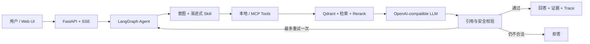

# GRC Copilot

**一个面向法规问答、条款比较和控制差距分析的证据优先合规 Agent。**

[English](README.md) | 简体中文

GRC Copilot 是一个面向治理、风险与合规工作的作品集项目。它组合了版本化法规证据、父子分块检索、LangGraph 编排、渐进式 Skills、确定性引用校验、兼容 MCP 的 Tools，以及可观察的流式 UI。

法规问答可以选择启用**多模态 RAG**：ColQwen2 直接检索 PDF 整页图像，Qdrant 使用 MaxSim 重排，再与文本条款检索融合；视觉大模型会真正读取被引用的页面图片，适合表格、图示和依赖版面的内容。完整说明见 [MULTIMODAL_RAG.md](MULTIMODAL_RAG.md)。

项目遵守一个简单原则：回答流畅还不够。重要结论应该指向具体来源、版本和章节；证据不足时，Agent 应该拒答。

## 三种工作模式

| 模式 | 用途 | 安全边界 |
|---|---|---|
| 法规问答 | 根据版本化法规证据回答问题 | 找不到可用证据时拒答 |
| 条款比较 | 保留左右两侧证据并比较两个条款 | 任意一侧缺失时拒答 |
| 控制差距分析 | 把企业控制事实与法规要求进行对照 | 必须提供当前状态，最终结论交给人工复核 |

在差距分析中，`control_text` 描述企业当前实际怎么做，而不是预先写好的合规结论。

## 架构



- **Graph** 负责路由、状态流转、重试上限、取消和终止状态。
- **Skills** 提供任务 SOP 和拒答边界，只加载当前匹配的 Skill。
- **Tools** 执行确定性搜索和精确条款获取；控制提取与差距映射由 LLM 在受治理的 Graph 流程内完成。
- **Validation** 检查引用、版本、证据支持情况和越权合规结论。

## 快速启动

真实应用需要 Docker Compose v2，以及一个兼容 OpenAI Chat Completions 的模型端点。

创建 `.env`：

```powershell
Copy-Item .env.example .env
```

macOS/Linux 用户可以改用 `cp .env.example .env`。

在 `.env` 中填写 `LLM_API_KEY`、`LLM_BASE_URL` 和 `LLM_MODEL`，并保留 `APP_RUN_MODE=real`。

启动应用和 Qdrant：

```bash
docker compose up --build --wait
```

首次启动会下载 Embedding 与 Rerank 模型，并根据仓库中的受治理解析语料构建 Qdrant 索引；后续启动会复用模型与 Qdrant volume。

打开 [http://127.0.0.1:8000](http://127.0.0.1:8000)。

可以尝试：

```text
法规问答：      《数据安全法》对数据安全管理制度有什么要求？
条款比较：      比较《数据安全法》与《网络安全法》的安全事件处置要求
控制差距分析：  检查管理员身份鉴别控制差距
企业当前控制：  管理员目前仅使用账号和密码登录，尚未启用多因素认证。
```

停止服务：

```bash
docker compose down
```

如果只想离线检查 UI 与流式协议，可以设置 `APP_RUN_MODE=demo`。Demo 模式范围很窄，也不再是应用默认运行方式。

## 开发与测试

环境要求：Python 3.13 和 [`uv`](https://docs.astral.sh/uv/)。

```bash
uv sync --locked
uv run pytest -p no:cacheprovider -q
uv run python -m evals.validate_dataset evals/dataset.jsonl
```

当前验证结果：

```text
320 passed
valid=60 invalid=0
```

原始来源文件和构建后的向量索引有意排除在 Git 之外；首次建索引所需的受治理解析语料会纳入仓库。来源记录见 [SOURCES.md](SOURCES.md)。

## 安全边界与局限

- 检索文本被视为不可信输入，并使用转义后的证据边界包装。
- 版本冲突和无效引用编号会在语义模型判断前失败。
- 证据为空时直接拒答，不调用回答生成器。
- 差距分析不能直接宣称企业已经确定合规或违法。
- Graph 最多重试一次，并支持真实任务取消。
- 外部 Trace 只暴露白名单运行字段，不包含 API key、Skill 正文、完整 Prompt 或隐藏推理。
- Docker 部署面向本地作品集演示，不是经过加固的生产环境。
- 当前语料覆盖五个受治理来源和 60 个评测样例，不代表所有司法辖区或框架。
- 法律解释和最终合规判断仍必须由人工复核。

## 仓库结构

```text
agent/       LangGraph 工作流、Skills 和工具适配器
api/         FastAPI、SSE、安全 Trace 和取消
evals/       数据集、指标、消融和最终评测
ingest/      解析、父子分块和索引
mcp_server/  通过 MCP 暴露 GRC Tools
rag/         检索、Rerank、生成和引用校验
skills/      GRC 任务 SOP
web/         三种模式的可观察 UI
```
