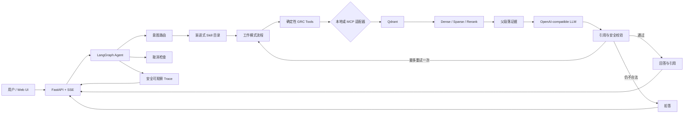

# GRC Copilot

**一个面向法规问答、条款比较和控制差距分析的证据优先合规 Agent。**

[English](README.md) | 简体中文

GRC Copilot 是一个面向作品集和求职展示的治理、风险与合规原型。项目组合了版本化法规证据、混合 RAG 组件、渐进式披露的工作流 Skills、LangGraph 编排、确定性引用校验、MCP 工具边界，以及可观察的流式 UI。

项目遵守一个核心原则：回答流畅还不够。每个重要结论都应该能追溯到具体来源、版本和章节；当现有证据无法支持请求时，系统应该拒答。

> **项目状态：**仓库包含摄取、检索、Agent、校验、评测、MCP、API 和 UI 组件。为了让用户无需私有语料、已构建索引或 API key 也能复现，Docker 快速启动有意使用确定性 fixture。详见[这个 Demo 能证明什么、不能证明什么](#这个-demo-能证明什么不能证明什么)。

## 为什么要做这个项目？

通用聊天界面直接用于合规工作会带来明显风险：

- 同一个章节编号在不同文档版本中可能代表不同内容；
- 跨法规比较只要缺少任意一侧证据，结论就不成立；
- 企业控制描述只是当前事实，不是企业已经合规的证明；
- 看似合理但无法支撑结论的引用，比明确拒答更危险；
- 操作人员需要知道系统调用了哪些工具，也需要能停止昂贵任务。

GRC Copilot 把这些问题落实成明确的软件边界、测试和评测指标，而不是只依赖一个更长的 Prompt。

## 三种工作模式

| 模式 | 输入 | 输出 | 拒答边界 |
|---|---|---|---|
| 法规问答 | 关于已收录法规或标准的问题 | 带版本化引用的有依据回答 | 找不到可用法规证据时拒答 |
| 条款比较 | 两个可明确定位的条款、文档或版本，以及比较维度 | 分开的左右证据和限定范围的比较 | 任意一侧缺失或比较维度无依据时拒答 |
| 控制差距分析 | 法规要求问题，以及企业当前控制事实 | 要求到控制的映射、差距、风险、建议和证据 | 缺少当前状态或法规证据时拒答；绝不直接作出最终合规结论 |

在差距分析中，`control_text` 是用户对企业当前实际做法的描述，例如“管理员账户目前只使用密码”。它不应该包含“我们已经合规”这类预先写好的结论。Agent 会把这段事实与检索到的要求比较，最终判断仍交给人工复核人员。

## 架构



检索链路使用子块进行精确匹配，在生成前扩展为带版本信息的父章节。最终答案使用 `GBT-22239@2019#7.1.4.1` 这样的父段落证据 ID，而不是 Qdrant 内部 point ID。

### Graph、Skills 和 Tools 分别负责什么？

| 层 | 负责 | 不负责 |
|---|---|---|
| Graph | 状态流转、路由顺序、重试上限、取消检查、校验和终止状态 | 法规内容或具体后端的检索代码 |
| Skills | 某类任务的 SOP、证据要求、拒答边界和输出结构 | 工具执行、网络请求或可变状态 |
| Tools | 确定性搜索、条款获取、比较、控制提取和差距映射 | 工作流策略或最终合规判断 |
| LLM | 意图建议、有依据草稿、查询改写和结构化提取 | 充当事实来源，或绕过校验的权限 |
| Validator | 引用编号、来源与版本一致性、主张支持情况、差距分析安全边界 | 创作回答 |
| API | 稳定 SSE 事件、安全 Trace 投影、任务注册、取消和健康检查 | 隐藏推理或原始 Agent 内部状态 |

Skills 使用渐进式披露：路由器只看到轻量目录，只有匹配到的 Skill 正文和资源会被加载。不支持的请求不会加载任何领域 Skill。

## 关键工程决策

- **版本化证据契约：**`source_id`、`version`、`section_number` 和 `parent_id` 贯穿解析、索引、检索、生成和校验。
- **父子分块检索：**小型子块提高匹配精度，扩展后的父章节为模型提供足够的法规和技术上下文。
- **证据门控生成：**检索结果为空时，绝不调用回答生成器。
- **确定性检查优先：**不存在的引用编号和版本冲突，会在语义蕴含判断之前失败。
- **有限重试：**无效答案可以触发一次查询改写和重试；第二次仍失败就拒答。
- **渐进式 Skills：**只加载当前模式需要的 SOP，减少输入 Token 和无关指令。
- **本地/MCP 对等：**Graph 调用稳定工具接口，后端可以是本地 Python 函数，也可以是 MCP。
- **可观察但不泄露：**浏览器只接收节点、工具、耗时和状态等安全字段，不接收完整 Prompt、Skill 正文、API key 或隐藏推理。
- **可取消任务：**工作流前后都会检查取消状态，API 会等待协程清理，停止的请求不会残留成僵尸任务。

## 快速启动：确定性 Docker Demo

这是从干净仓库启动浏览器 UI 的最快路径。它需要 Docker Compose v2，**不需要** LLM API key。

### 1. 创建本地环境文件

macOS/Linux：

```bash
cp .env.example .env
```

PowerShell：

```powershell
Copy-Item .env.example .env
```

默认的 `APP_RUN_MODE=demo` 是当前唯一支持的容器运行模式。

### 2. 构建并启动两个服务

```bash
docker compose up --build --wait
```

Compose 只启动两个服务：

- `app`：FastAPI、浏览器 UI、稳定 SSE 契约和确定性 Demo fixture；
- `qdrant`：Qdrant `v1.18.2`，包含就绪检查和持久化存储。

### 3. 打开 UI

打开 [http://127.0.0.1:8000](http://127.0.0.1:8000)，选择一种模式，然后尝试：

```text
法规问答：      管理员身份鉴别有哪些要求？
条款比较：      比较两项身份鉴别条款的要求和适用范围
控制差距分析：  检查管理员身份鉴别控制差距
企业当前控制：  管理员目前仅使用账号和密码登录，尚未启用多因素认证。
```

右侧面板会把证据卡片和 Agent Trace 分开展示。答案中的 `[1]` 对应第一张证据卡片。

### 4. 检查服务就绪状态

```bash
docker compose ps
curl http://127.0.0.1:8000/ready
curl http://127.0.0.1:6333/readyz
```

如果 Windows PowerShell 把 `curl` 映射成了 `Invoke-WebRequest`，请使用 `curl.exe`。

两个容器都应该显示 healthy。应用会等待 Qdrant 就绪，然后才接受 `/chat` 请求。

### 5. 可选：SSE 冒烟测试

macOS/Linux：

```bash
curl -N -X POST http://127.0.0.1:8000/chat \
  -H 'Content-Type: application/json' \
  -d '{"request_id":"readme-qa","mode":"regulation_qa","query":"管理员身份鉴别有哪些要求？"}'
```

PowerShell：

```powershell
curl.exe -N -X POST http://127.0.0.1:8000/chat `
  -H "Content-Type: application/json" `
  -d '{"request_id":"readme-qa","mode":"regulation_qa","query":"管理员身份鉴别有哪些要求？"}'
```

事件流应该依次包含 `status`、一个或多个 `text`、带版本的 `reference`、安全的 `trace`，以及一个终止 `done` 事件。

### 停止和清理

```bash
docker compose down
```

这会保留 `qdrant_storage` 和 `model_cache` 两个命名卷。下面的命令具有破坏性：

```bash
docker compose down --volumes
```

它会删除 Qdrant 数据和容器模型缓存。

### 快速启动故障排查

- **无法识别 `docker`：**安装 Docker Desktop，或安装带 Compose v2 插件的 Docker Engine；启动 Docker daemon，重新打开终端，并先确认 `docker compose version` 能运行。
- **容器处于 unhealthy：**运行 `docker compose ps`、`docker compose logs qdrant` 和 `docker compose logs app`。应用会有意保持未就绪状态，直到 Qdrant 能正常响应。
- **8000 或 6333 端口已被占用：**修改 `.env` 中的 `APP_HOST_PORT` 或 `QDRANT_HOST_PORT`，然后重新运行 Compose。
- **第一次构建时间较长：**镜像和锁定的 Python 包需要下载一次；之后可以复用构建缓存和命名模型缓存。

## 这个 Demo 能证明什么、不能证明什么？

Docker Demo 能证明干净仓库可以复现：

- app 与 Qdrant 的启动顺序和就绪检查；
- 三种模式的浏览器工作流；
- 稳定的 Server-Sent Events；
- 回答流、证据卡片、建议和安全 Trace；
- 请求取消和终止清理；
- 持久化的 Qdrant 与模型缓存位置。

Demo runner 返回的是明确的 fixture。它**不声称**回答由 LLM 生成，也不声称 fixture 证据由 Qdrant 检索得到。这是有意设计的：

- 未提交具有许可证限制或需要治理的原始语料；
- 未提交构建后的向量索引和本地模型缓存；
- 容器镜像只安装较小的部署依赖组；
- `api.main:app` 故意使用未配置 runner，缺少生产组合时会明确失败，而不会静默返回 Demo 答案。

真实部署必须提供受治理文档、构建索引、配置 OpenAI-compatible 模型端点，并注入真实 Agent runner。仓库已经实现这些底层组件，但不会把确定性部署 fixture 重新包装成生产系统。

## API 与事件契约

### 端点

| 方法 | 路径 | 用途 |
|---|---|---|
| `GET` | `/health` | 进程存活状态和活动任务数 |
| `GET` | `/ready` | 依赖就绪状态 |
| `POST` | `/chat` | 启动一个流式 Agent 请求 |
| `POST` | `/tasks/{request_id}/stop` | 取消活动请求并等待清理 |

`POST /chat` 接受：

```json
{
  "request_id": "optional-client-id",
  "mode": "regulation_qa",
  "query": "管理员身份鉴别有哪些要求？",
  "control_text": ""
}
```

七种稳定 SSE 事件类型是：

```text
status · text · reference · recommendation · trace · done · error
```

每条流必须以且只能以一个 `done` 或 `error` 结束。终止事件之后到达的事件，以及属于其他 request ID 的事件，会被浏览器契约忽略。

## 本地开发

### 环境要求

- Python 3.13
- [`uv`](https://docs.astral.sh/uv/)
- 需要 Qdrant 检索时安装 Docker
- CUDA 可选；运行时设备选择也支持 CPU

安装锁定环境并运行测试：

```bash
uv sync --locked
uv run pytest -p no:cacheprovider -q
```

当前验证结果：

```text
270 passed
```

校验固定评测集：

```bash
uv run python -m evals.validate_dataset evals/dataset.jsonl
```

预期结果：

```text
valid=60 invalid=0
```

连接本地 Qdrant 并运行确定性部署应用：

```bash
QDRANT_URL=http://127.0.0.1:6333 \
uv run uvicorn api.deployment:app --host 127.0.0.1 --port 8000
```

PowerShell：

```powershell
$env:QDRANT_URL = "http://127.0.0.1:6333"
uv run uvicorn api.deployment:app --host 127.0.0.1 --port 8000
```

摄取和评测链路使用完整本地依赖。语料来源和解析选择记录在 [SOURCES.md](SOURCES.md) 中。原始文件应该放在 Git 忽略的 `data/raw/` 目录。

## 评测

冻结数据集包含 60 个样例，覆盖法规问答、跨法规比较、控制差距分析、口语问题、拒答和版本陷阱。Gold 引用是根据来源材料定义的版本化父章节 ID，不是从 Agent 当前回答中复制出来的。

### 最终端到端结果

| 指标 | 结果 | 范围 |
|---|---:|---|
| Recall@5 | 79.79% | 47 道可回答题 |
| Recall@20 | 85.11% | 47 道可回答题 |
| MRR | 0.7218 | 47 道可回答题 |
| Citation precision | 36.70% | 47 道可回答题 |
| Citation coverage | 68.09% | 47 道可回答题 |
| Refusal accuracy | 85.00% | 全部 60 题 |
| Intent accuracy | 93.33% | 全部 60 题 |
| Skill trigger accuracy | 93.33% | 全部 60 题 |
| P50 latency | 8,776.81 ms | 端到端 |
| P95 latency | 35,727.05 ms | 端到端 |
| Average tokens | 3,411.52 | 端到端 |

这些是实际观测结果，不是承诺。85% 的拒答目标和 90% 的 Skill 触发目标已经达到。90% 的引用准确率目标**没有达到**；36.70% 被如实保留，也是当前系统最明确的质量局限。

最终运行最多保留 20 条检索结果，用于真正计算 Recall@5/20，并把前 5 条送入生成。单变量试验只把生成上下文从 5 条减少到 3 条。在路由相同的配对样例中，citation precision 只提升 0.19 个百分点，而 citation coverage 下降 11.36 个百分点，因此该试验被拒绝。

只有在配置好真实语料、索引和 `.env` 中的 `LLM_*` 后，才能运行最终评测器：

```bash
uv run python -m evals.run_eval
```

评测器会记录数据集、Prompt、Skill、参数、Git 和配置哈希，并保留所有错误，不会过滤失败样例。

## 检索消融

八种检索组合在同一份冻结数据集和语料上运行。下表是单独的检索实验，不能与前面的端到端 Agent 结果混为同一个口径。

| 分块 | Sparse | Rerank | Recall@5 | MRR | P95 ms |
|---|---:|---:|---:|---:|---:|
| 固定窗口 | 否 | 否 | 50.00% | 0.3807 | 42.69 |
| 固定窗口 | 否 | 是 | 60.64% | 0.4628 | 239.90 |
| 固定窗口 | 是 | 否 | 55.32% | 0.4090 | 46.69 |
| 固定窗口 | 是 | 是 | 68.09% | 0.5397 | 238.40 |
| 父子分块 | 否 | 否 | 69.15% | 0.5673 | 39.80 |
| **父子分块** | **否** | **是** | **81.91%** | **0.7365** | 243.46 |
| 父子分块 | 是 | 否 | 68.09% | 0.6330 | 45.07 |
| 父子分块 | 是 | 是 | 80.85% | 0.7110 | 242.43 |

最大的单项提升来自父子分块：在 Dense、无 Rerank 的条件下，Recall@5 比固定窗口提高 19.15 个百分点。Rerank 又为父子证据增加 12.77 个百分点，但需要付出延迟成本。Sparse/混合检索没有改善父子分块配置，因此最终链路关闭了 Sparse。

## Skills 消融

Skill 实验固定了问题、任务标签、证据、模型、温度和输出上限，只改变工作流指令的披露方式。

| 策略 | 平均输入 Token | P95 ms | 结构成功率 | 引用格式 | 误触发率 | 漏触发率 |
|---|---:|---:|---:|---:|---:|---:|
| 无 Skill | 398.42 | 14,414.34 | 58.33% | 75.00% | 0.00% | 100.00% |
| 全量 SOP | 1,922.42 | 33,137.44 | 75.00% | 75.00% | 100.00% | 0.00% |
| **渐进式** | **779.42** | 23,896.23 | **91.67%** | **91.67%** | **0.00%** | **0.00%** |

与加载全部 SOP 相比，渐进式披露把平均输入 Token 降低 59.46%，并且在这个 12 题受控子集中，结构成功率没有下降，反而提高。这个结果支持把 Skills 用作任务 SOP，而不是用它替代工具或校验器。

## 失败案例分析

系统按照第一个出现偏差的可观察层进行归因，而不是把所有下游症状都归咎于最终模型输出。

| 案例 | 第一个失败层 | 证据 | 为什么重要 |
|---|---|---|---|
| `grc-v0-011` | 检索 | 路由和 Skill 正确，但第二侧比较所需的 gold 章节没有进入 Top-20 | 单边比较必须拒答，不能编造缺失一侧 |
| `grc-v0-021` | 路由 / Skill | 法规问题被判成 unsupported，因此 Skill 和检索都没有执行 | 早期路由错误会让所有下游指标一起变差 |
| `grc-v0-001` | 生成 | 正确 gold 排第 1，但答案引用了另一个安全等级的相似章节 | 看起来专业、带引用但引用错误的答案，比明确拒答更危险 |

当前最重要的开放质量问题，是生成阶段的证据选择和引用校验。下一轮应该加强章节感知选择、比较任务的左右分侧检索，以及主张到引用的验证，而不是通过删除困难样例隐藏失败。

## 安全边界

- 检索到的文档文本被视为不可信输入。在使用 `<evidence>` 边界包装之前，会先转义可伪造 HTML 边界的字符。
- `parent_id` 与证据 metadata 之间的版本冲突，会在语义模型判断前确定性失败。
- 不存在的引用编号、无引用事实主张和无法由证据支持的主张都会校验失败。
- 差距分析必须包含人工复核声明，不能宣称企业已经确定合规或违法。
- 证据为空时直接拒答，不调用回答生成器。
- Graph 最多重试一次，并设置明确的最大步数。
- 工作流前后都会检查取消；API 会等待任务清理。
- 外部 Trace 使用字段白名单。完整问题、API key、Skill 正文和隐藏推理不会作为 Trace 事件输出。
- 本原型辅助证据审阅，不提供法律意见，也不能替代合格的合规或法律复核人员。

回归测试明确覆盖文档 Prompt Injection、版本冲突、无答案、取消、僵尸任务清理和安全 Trace 投影。

## 语料与来源

版本库跟踪了五份文档的来源记录：

- GB/T 22239—2019；
- GB/T 35273—2020；
- GDPR，Regulation (EU) 2016/679；
- 2025 年发布修订文本的《中华人民共和国网络安全法》；
- 2021 年《中华人民共和国数据安全法》。

来源位置和解析选择见 [SOURCES.md](SOURCES.md)。ISO/IEC 27001 全文因付费而未收录；Docker 比较模式显示的 ISO 条目是明确标注的确定性 fixture，不是已提交的生产语料。

## 仓库结构

```text
agent/       LangGraph 状态、节点、Skills、取消、本地/MCP 适配器
api/         FastAPI、稳定 SSE、安全 Trace、任务管理、Demo 组合
evals/       60 题数据集、指标、检索/Skill 消融、最终评测器
ingest/      版本化解析、父子分块、Embedding、Qdrant 索引
mcp_server/  通过 MCP 暴露确定性 GRC Tools
rag/         Dense/Sparse 检索、融合、Rerank、生成、引用校验
runtime/     CPU/CUDA 设备选择
skills/      法规问答、条款比较和差距分析 SOP
tests/       契约、回归、安全、评测和部署测试
web/         三种模式的可观察浏览器 UI
```

## 当前局限

- Docker 部署是确定性 Demo，不是生产组合根。
- 原始语料、构建后的索引和模型缓存有意排除在 Git 之外。
- Citation precision 仍低于项目目标。
- 评测覆盖五个受治理来源和 60 个样例，不代表所有司法辖区或合规框架。
- 差距分析依赖用户提供的当前控制事实是否准确和完整。
- 法律解释、适用性和最终合规判断仍必须由人工复核。

这些局限被明确保留，因为项目的价值不是“一个永远回答问题的 LLM”，而是一个能够说明证据、编排和人工责任边界的可检查系统。
